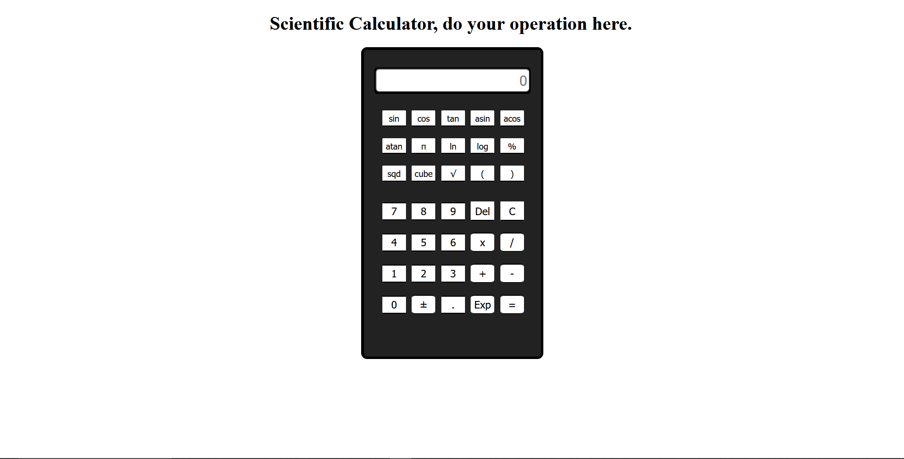

<h1 align="center"> Scientific Calculator </h1>

Programa Desenvolvindo durante o meu apredizado das tecnologias WEB.  
A cada projeto desenvolvido, por mais simples que seja o projeto acabamos sempre por aprender alguma coisa. E durante a realização da Scientific Calculator pode aprender muito,  sobre o html, css e JavaScript.  

  <a href="#-tecnologias">Tecnologias</a>&nbsp;&nbsp;&nbsp;|&nbsp;&nbsp;&nbsp;
  <a href="#-projeto">Projeto</a>&nbsp;&nbsp;&nbsp;|&nbsp;&nbsp;&nbsp;
  <a href="#-layout">Layout</a>&nbsp;&nbsp;&nbsp;|&nbsp;&nbsp;&nbsp;

  

 

  

## 🚀 Tecnologias

Esse projeto foi desenvolvido com as seguintes tecnologias:

- HTML e CSS
- JavaScript
- Git e Github

## 💻 Projeto

O Scientific Calculator, é uma calculadora online que nós permite realizarmos cálculos usando o navegador.

## :memo: Licença

Esse projeto está sob a licença MIT.

---
Feito durante a minha jornada de aprendizagem.
